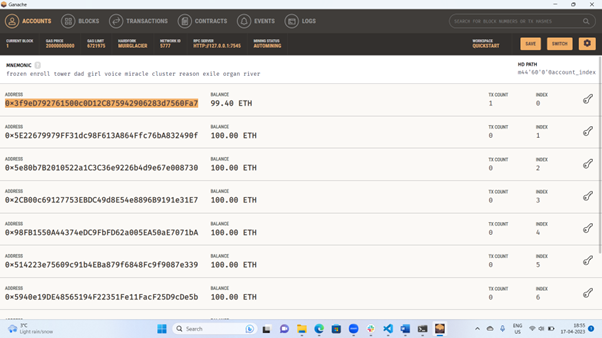

# Module-19-assignment

### The task for this assignment revolved around integrating the Ethereum Blockchain network into an application for hiring fintech professionals, and paying them in cryptocurrency.

### Furthermore, I was also tasked with assuming the role of being a customer for this application - KryptoJobs2Go, for the purpose of confirming and validating this network.   

> Based on the abovementioned screenshot, it is confirmed that a transaction on KryptoJobs2Go has been executed and validated, and that the Ethereum Blockchain network has been successfully integrated into this application. 

---

>This screenshot confirms that the account linked to the app has recorded a transaction, and appropriate crypto balance has been debited.
---

>Lastly, it has been confirmed that respective Fintech Professional that was chosen has received their payment in crypto, based on the transaction acknowledgement available in this screenshot.  